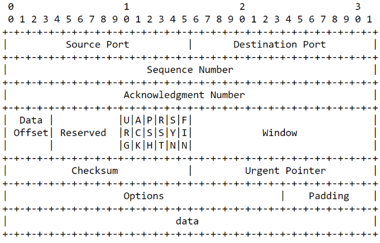

# CharlieTheSniffer
Charlie The Sniffer is a basic packet sniffer tool that I have created for a university project. It is launched fromthe command line interface. It provides the live output of the sniffed traffic and/or the output in a pcap file.

### *** DISCLAIMER ***
This tool is for educational purpose only. Before use it, you must ensure that you have the right permissions to run it. I am not responsible in any way for any illegal and/or not authorized action that you will carry out.

## Random ideas on how to bring it to life
1. Liberty to choose which interface to use (if wlan in -> what actually is monitor mode? Do we actually need it?)
2. Printing live capture on the terminal
3. Saving the capture on pcap files vs raw txt files (Can it be done?!)
4. Fixed time capture vs. time stopped by key combination
5. Which proto can we sniff by default?
6. Adding filter to sniff specific proto
7. It has to be a cmd line tool, so parsing argument at the beginning is a MUST -> help message is REQUIRED
8. Give the user the choice to sniff only his traffic or all traffic coming to his in

## Table of Contents
  * [Installation](#installation)
  * [Usage](#usage)
  * [Dependencies](#dependencies)
  * [Network packets format](#network-packets-format)
    * [TCP Packet](#tcp-packet)
    * [IP Packet](#ip-packet)
    * [ICMP Packet](#icmp-packet)
    * [UDP Datagram](#udp-datagram)
  * [The program behaviour](#the-program-behaviour)
    * [High level view](#high-level-view)
    * [Mid level view](#mid-level-view)
    * [Low level view](#low-level-view)
    * [Gathering the right information](#gathering-the-right-information)
  * [References](#references)
  
## Installation
## Usage
##  Dependencies

**OS**: Linux (Tested on Pop_OS! Linux Kernel vx.x)

**Libraries**: libpcap

**Privileges**: root

## Network packets format
Before going deeper with the code, in order to gain a better understanding of the logic behind the code, we have to understand how the data transmitted are formatted.
So let's begin.
(Add quick brief on TCP/IP behaviours)

### TCP Packet
The Transmission Control Protocol packet is composed by a header, that includes all the options and details on how the packet should be handled, and a payload, containing the actual data transmitted.

Let's take a look at the header structure (source: [RFC 793](https://tools.ietf.org/html/rfc793)):

Just to clarify, the first number row (0-3), are bytes (It indicates, the second number row are bits. Giving that, this is the map that we must follow to gather the right information from the TCP header. For example, we will need to know what will be the source port and the destination port of the given packet. In this case, we will have to fetch from the header the first 16 bytes for the former and the second 16 bytes for the latter. And so on for every other information that we will need.

### IP Packet
The Internet Protocol packet is similar to the TCP packet, it is composed by a header and a payload. Obviously, the packet fields will differ but the logic will be the same.

Give it a look (source: [RFC 791](https://tools.ietf.org/html/rfc791)):

### ICMP Packet
The Internet Control Message Protocol is a little bit different. It does not rely on a dedicated packet structure, but it is integrated with the IP header where we will find the number 1 inside the protocol flag, then the first octet of the data portion of the datagram is used as the ICMP type field, that will affect the following bits. 
The data field will differ based on which message will be provided.

The most common ICMP message is the ECHO/ECHO REPLY, unchained by the well known PING command.

It will be as follow (source [RFC 792](https://tools.ietf.org/html/rfc792)):

### UDP Datagram
The User Datagram Protocol is the opposite of the TCP. While TCP is connection-oriented, UDP is connectionless. It does not mean that there won't be any connection as suggested, but that for each connection that will be provided it won't verify the receipt.
For this reason and for more technical others, the packet (called datagram in connectionless protocols) structure is quite simpler.

Here we don't have only a header and a payload, infact the UDP datagram is shipped with a pseudoheader prefix generated from the IP header, that it is necessary to calculate the checksum.

UDP datagram payload(source [RFC 768](https://tools.ietf.org/html/rfc768)):

UDP pseudo header (source [RFC 768](https://tools.ietf.org/html/rfc768)):

## The program behaviour
This sniffer has been created to be used from a command line interface. It means that in order to use it you have to provide some options and arguments in addition to the program name. We are going to look them in details later.

### High level view
Now, we have to focus on the behaviour at the mid-high level, it is as follow:
1. Launch the program with the choosen interface and options;
2. Charlie will check if the device is available, if it is not, it will tell you and exit;
3. Otherwise, if it is available, it will prepare the device so it will be able to sniff, if negative it will tell you and stop;
4. If it succeeds, it will go on a sort of loop and start the actual sniffing;
5. Now, for every captured packet, it will check the protocol then it will print out on terminal/file the whole TCP or UDP packet (headers + payloads)

### Mid level view
Once we have the high level in mind, let's see what functions we are going to use.
First, we are going to see the functions created by me. I am going to show them with the aid of a table. The table is quite self explanatory, but just to be clear in the first column I've put the function category that we are going to find inside the code comments. These categories are just a logical subdivisione made by me to have a cleaner code.

Let's see the table:

| Function category   | Function name   |   Task                                     | 
| :-------------: | :-------------: | :------------------------------------------:
| support               | showInterfaces()        | it prompts the available interfaces using the pcap_findalldevs()|
| support               | usage()        | it issues the helping message |
| support               | showError()        | it prompts the error in a standardized and simple format|
| support               | showStatus()        | it prompts the status in a standardized and simple format|
| sniffer               | cookingPreSniffer()        | it prepares the dev to sniff, then it launches the actual sniffing task|
| sniffer               | packetHandler()        | it handles actions to be done against every captured packet|
| sniffer               | printTcpHeader()        | it prints the TCP header |
| sniffer               | printIpHeader()        | it prints the IP header |
| sniffer               | printIcmpHeader()        | it prints the ICMP header |
| sniffer               | printUdpDatagram()        | it prints the UDP datagram |
| sniffer               | printPayload()        | it prints the payload |

Second, let's take a look at the functions used from the libpcap library. Again, I am going to use a table. This time, in the first column I will put one of my function where we can find the caller to the libpcap function.

| Position   | Function name   |   Task                                     | 
| :-------------: | :-------------: | :------------------------------------------:
| showInterfaces()      | pcap_findalldevs()        | it constructs a list of network devices that can be opened with other functions |
| cookingPreSniffer()               | pcap_open_live()        | it is used to obtain a packet capture handle to sniff packet on the network |
| cookingPreSniffer()               |  pcap_loop()        | it starts the actual sniffing and it does it by looping|

### Low level view
For this section, I will let the code comments speak for me as I think that is unecessary write each function prototype and show each arguments here.

### Gathering the right information
I find all this stuff quite interesting, but it is useless if we don't know how to get exactly the right information from a packet composed by multiple bytes.
To do so, we just have to think about the packet structure. It is just a sequence of bytes, so if we want to move get some portion of it all we need is to do some basic maths. Just a couple of sums/diffs and we well have what we want. Let's see it in _action_ inside a table:

| Variable          | Location in bytes   |   
| :---------------: | :-------------: 
| Ethernet size     |     X               |
| IP header length            | X + Ethernet Size |
| TCP header length | X + Ethernet Size + IP header length |
| Payload           | X + Ethernet Size + IP header length + TCP header length |

## References
Here you will find documents and other references that I used to bring CharlieTheSniffer to life:
* [Official website for LibPcap](http://www.tcpdump.org/pcap.html) 
* [pcap_open_live man page](https://www.tcpdump.org/manpages/pcap_open_live.3pcap.html)
* [pcap_findalldevs man page](https://www.tcpdump.org/manpages/pcap_findalldevs.3pcap.html)
* [pcap_loop](https://www.tcpdump.org/manpages/pcap_loop.3pcap.html)
* [Protocol numbers](https://www.iana.org/assignments/protocol-numbers/protocol-numbers.txt)
* [RFC 768](https://tools.ietf.org/html/rfc768)
* [RFC 791](https://tools.ietf.org/html/rfc791)
* [RFC 792](https://tools.ietf.org/html/rfc792)
* [RFC 793](https://tools.ietf.org/html/rfc793)
* [Tutorials Point for C](https://www.tutorialspoint.com/cprogramming/index.htm)
* [Write a good C main fun](https://opensource.com/article/19/5/how-write-good-c-main-function)
* 

***Btw, KISS is your best friend.***
